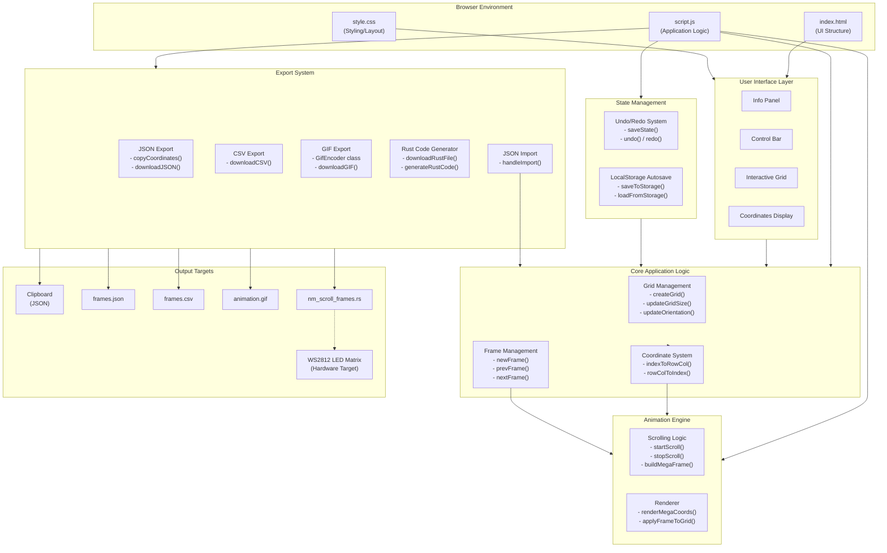

# Architecture

## System Diagram



## Architecture Overview

### Design Philosophy

I built NeoMatrix Frame Creator as a zero-dependency, client-side web application. This decision was intentional: the tool needed to be instantly accessible to hardware engineers and makers who may not have Node.js or complex build environments set up. By keeping everything in vanilla HTML, CSS, and JavaScript, users can simply open the file in a browser or access it via GitHub Pages.

### Key Architectural Decisions

#### 1. Single-Page Application Without Frameworks

I chose not to use React, Vue, or any frontend framework. For a tool this focused, vanilla JavaScript provides:
- Zero build step required
- Instant load times
- Easy deployment to GitHub Pages
- No dependency management headaches

The trade-off is more manual DOM manipulation, but for a single-purpose tool, this is acceptable.

#### 2. State Management with Autosave

All frame data lives in a simple JavaScript array structure with per-pixel color support:
```javascript
let frames = [{ coords: [{ row: 0, col: 1, color: "#00f0ff" }], name: "Frame 1" }];
```

State is automatically persisted to localStorage every 30 seconds and on page unload, so users never lose work between sessions. A 50-step undo/redo stack (Ctrl+Z/Ctrl+Y) provides full editing history. JSON import allows loading previously exported projects back into the editor.

#### 3. Coordinate System Abstraction

The `indexToRowCol()` and `rowColToIndex()` functions form a crucial abstraction layer. LED matrices can be wired with the origin in any corner, and the direction of row/column addressing varies by manufacturer. By abstracting this, users can match their physical hardware layout without mental gymnastics.

#### 4. Rust Code Generation

Rather than just exporting data, I generate complete, compilable Rust code. This was a deliberate choice for the target audience (University of Florida Computer Engineering students working with embedded Rust). The generated code includes:
- Proper struct definitions with `NmScroll` struct
- Per-pixel RGB color data in static arrays (each pixel stores its own color)
- A working scrolling animation loop with configurable delay
- `clear()`, `set()`, `draw_frame()`, and `next()` methods
- `Default` trait implementation

This reduces the barrier from "I have coordinate data" to "I have working code."

#### 5. Animation Preview System

The scrolling preview uses a "megaframe" approach where all frames are concatenated horizontally. This mirrors how text/graphics actually scroll across physical LED matrices, giving users accurate visual feedback before deploying to hardware.

### Data Flow

1. **User Input**: Clicks on grid cells toggle coordinates in the active frame (each pixel stores its own color)
2. **State Snapshot**: `saveState()` pushes a deep copy to the undo stack before each mutation
3. **State Update**: The `frames` array is modified directly
4. **Visual Feedback**: `applyFrameToGrid()` syncs UI with state, applying per-pixel `--pixel-color` CSS custom properties
5. **Autosave**: State is periodically serialized to localStorage
6. **Export**: Frame data is serialized to JSON, CSV, animated GIF, or transformed into Rust code

### Limitations

- Grid size changes clear all frames (by design, to avoid coordinate conflicts)
- Mobile drag-and-drop for frame reordering may be less intuitive than desktop
- GIF export can be slow for very large grids or many frames due to client-side LZW encoding
