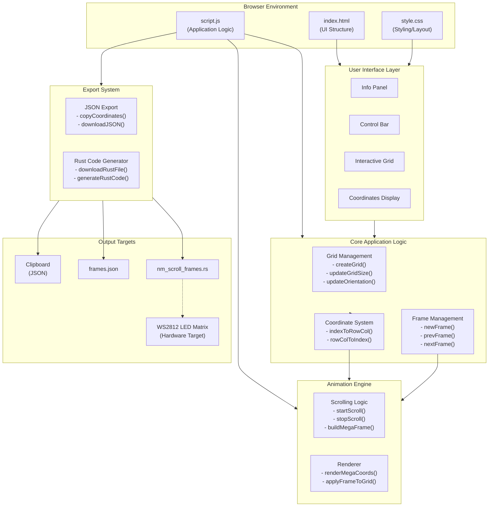

# Architecture

## System Diagram



## Architecture Overview

### Design Philosophy

I built NeoMatrix Frame Creator as a zero-dependency, client-side web application. This decision was intentional: the tool needed to be instantly accessible to hardware engineers and makers who may not have Node.js or complex build environments set up. By keeping everything in vanilla HTML, CSS, and JavaScript, users can simply open the file in a browser or access it via GitHub Pages.

### Key Architectural Decisions

#### 1. Single-Page Application Without Frameworks

I chose not to use React, Vue, or any frontend framework. For a tool this focused, vanilla JavaScript provides:
- Zero build step required
- Instant load times
- Easy deployment to GitHub Pages
- No dependency management headaches

The trade-off is more manual DOM manipulation, but for a single-purpose tool, this is acceptable.

#### 2. In-Memory State Management

All frame data lives in a simple JavaScript array structure:
```javascript
let frames = [{ coords: [], name: "Frame 1" }];
```

I avoided localStorage persistence intentionally. Frame designs are meant to be exported, not saved in the browser. This keeps the mental model simple: design, export, use in your hardware project.

#### 3. Coordinate System Abstraction

The `indexToRowCol()` and `rowColToIndex()` functions form a crucial abstraction layer. LED matrices can be wired with the origin in any corner, and the direction of row/column addressing varies by manufacturer. By abstracting this, users can match their physical hardware layout without mental gymnastics.

#### 4. Rust Code Generation

Rather than just exporting data, I generate complete, compilable Rust code. This was a deliberate choice for the target audience (University of Florida Computer Engineering students working with embedded Rust). The generated code includes:
- Proper struct definitions
- Memory-efficient static arrays
- A working animation loop

This reduces the barrier from "I have coordinate data" to "I have working code."

#### 5. Animation Preview System

The scrolling preview uses a "megaframe" approach where all frames are concatenated horizontally. This mirrors how text/graphics actually scroll across physical LED matrices, giving users accurate visual feedback before deploying to hardware.

### Data Flow

1. **User Input**: Clicks on grid cells toggle coordinates in the active frame
2. **State Update**: The `frames` array is modified directly
3. **Visual Feedback**: `applyFrameToGrid()` syncs UI with state
4. **Export**: Frame data is serialized to JSON or transformed into Rust code

### Limitations

- No undo/redo functionality (would require implementing a command pattern)
- No import capability (designed as one-way export tool)
- Grid size changes clear all frames (simplifies state management but loses work)
- Single color only in preview (hardware can have any color; this is a preview limitation)
