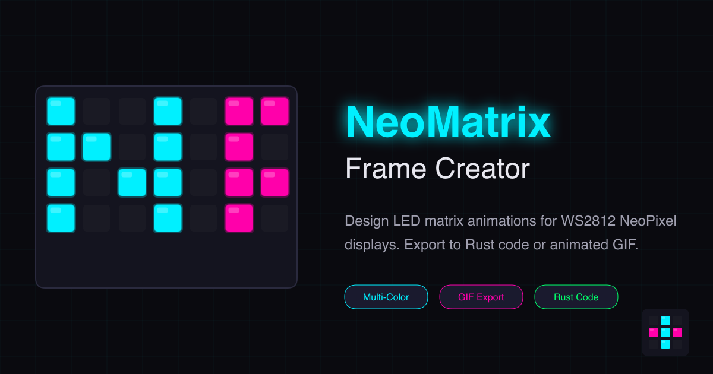

# NeoMatrix Frame Creator

[](https://technical-1.github.io/NeoMatrix-FrameCreator/)
[](LICENSE)

A web-based visual editor for designing LED matrix animations for WS2812 (NeoPixel) LED displays. Create multi-color pixel art, preview scrolling animations, and export to Rust code or animated GIF.



[**Try it live →**](https://technical-1.github.io/NeoMatrix-FrameCreator/)

---

## Features

### Core Editing
- **Dynamic Grid Size** — Support for rectangular grids from 1×1 to 64×64
- **Multi-Color Support** — Each pixel can have its own color with live color picker
- **Multiple Frames** — Create unlimited animation frames with drag-and-drop reordering
- **Undo/Redo** — 50-step history with Ctrl+Z / Ctrl+Y keyboard shortcuts
- **Autosave** — Work is automatically saved to localStorage every 30 seconds

### Animation
- **Scrolling Preview** — Watch your frames scroll across the grid in real-time
- **Adjustable Speed** — Control animation speed from 50ms to 2000ms per step
- **Orientation Modes** — Flip origin corner to match your physical matrix wiring

### Export Options
- **Rust Code** — Generate ready-to-compile `.rs` files with per-pixel RGB colors and animation speed
- **Animated GIF** — Export high-quality GIF animations with LED glow effects
- **JSON/CSV** — Download structured data for use in other applications
- **"Finished" Modal** — View complete Rust code with stats, copy to clipboard, or download

---

## How to Use

1. **Open the Tool**
   Go to [**NeoMatrix Frame Creator**](https://technical-1.github.io/NeoMatrix-FrameCreator/)

2. **Set Up Your Grid**
   - Set **Width** and **Height** for your matrix dimensions
   - Choose **Orientation** to match your LED wiring (top-left, top-right, etc.)
   - Select a **Color** using the color picker

3. **Create Frames**
   - Click cells to toggle pixels on/off (click again with same color to turn off)
   - Click a lit pixel with a different color to change its color
   - Use **New Frame**, **Duplicate**, and **Delete** to manage frames
   - Drag and drop frame thumbnails to reorder

4. **Preview Animation**
   - Set **Speed** (milliseconds per scroll step)
   - Click **Play** to watch your frames scroll across the grid
   - Click **Stop** to end the preview

5. **Export Your Work**
   - **JSON** — Save all frames with coordinates and colors
   - **CSV** — Export as spreadsheet-compatible format
   - **GIF** — Download animated GIF with LED glow effects
   - **Rust** — Download `.rs` file ready for your embedded project
   - **Finished** — Open modal with complete Rust code, stats, and copy/download options

---

## Keyboard Shortcuts

| Shortcut | Action |
|----------|--------|
| `Ctrl+Z` | Undo |
| `Ctrl+Y` | Redo |
| `Ctrl+←` | Previous frame |
| `Ctrl+→` | Next frame |
| `Space` | Toggle cell (when focused) |
| `Escape` | Close modal |

---

## Generated Rust Code

The tool generates complete Rust code compatible with the `smart_leds` crate. Example output:

```rust
use smart_leds::RGB8;

pub const WIDTH: usize = 8;
pub const HEIGHT: usize = 8;
pub const SCROLL_DELAY_MS: u32 = 200;

/// Pixel data: (x, y, r, g, b)
type Pixel = (usize, usize, u8, u8, u8);

pub struct NmScroll {
    strip: [RGB8; WIDTH * HEIGHT],
    frame: isize,
}

impl NmScroll {
    pub fn new() -> Self {
        Self {
            strip: [RGB8::new(0, 0, 0); WIDTH * HEIGHT],
            frame: 0,
        }
    }

    /// Get the recommended delay between scroll steps
    pub fn delay_ms() -> u32 {
        SCROLL_DELAY_MS
    }

    // Frame data with per-pixel RGB colors
    const FRAME_1: &'static [Pixel] = &[
        (0, 0, 0, 240, 255),   // Cyan pixel at (0,0)
        (1, 0, 255, 0, 170),   // Magenta pixel at (1,0)
        // ...
    ];

    pub fn next(&mut self) {
        // Scrolling animation logic
    }
}
```

Use `NmScroll::delay_ms()` in your main loop:

```rust
loop {
    animation.next();
    ws.write(animation.to_list().iter().cloned()).unwrap();
    delay.delay_ms(NmScroll::delay_ms());
}
```

---

## Development

This is a zero-dependency vanilla JavaScript project. No build step required.

```bash
# Clone the repository
git clone https://github.com/Technical-1/NeoMatrix-FrameCreator.git
cd NeoMatrix-FrameCreator

# Open in browser
open index.html
# Or use a local server
python -m http.server 8000
```

### Project Structure

```
├── index.html          # Main HTML with SEO meta tags
├── style.css           # Dark neon theme (~1300 lines)
├── script.js           # All application logic (~1600 lines)
├── favicon.svg         # SVG favicon
├── og-image.png        # Social media preview image
├── generate-pngs.js    # Node.js script for asset generation
└── CLAUDE.md           # AI assistant instructions
```

### Regenerating Assets

```bash
npm install
node generate-pngs.js
```

---

## Credits

Originally designed for the final project in the University of Florida class CEN4907C (Computer Engineering Design 1) for WS2812 LED matrix projects.

---

## License

ISC License — see [LICENSE](LICENSE) for details.
